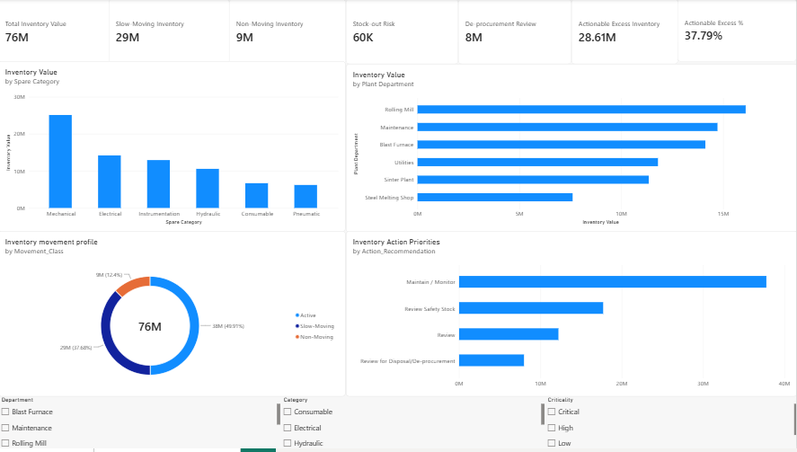
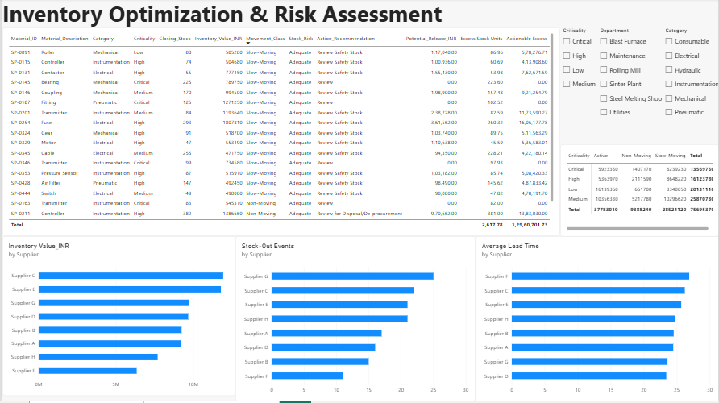

# Industrial Spares Inventory Optimization & Working-Capital Analysis

## Project Overview

Developed an industrial spares inventory optimization model using a synthetic dataset designed around an industrial inventory-management use case.

The project applies inventory analytics and Power BI to identify slow-moving and non-moving inventory, stock-out risks, excess inventory exposure, and potential working-capital optimization opportunities.

##  Business Objective

- Identify high-value inventory requiring management attention
- Classify inventory using ABC analysis
- Analyse inventory movement and criticality
- Identify potential stock-out risks using reorder-point logic
- Evaluate supplier-wise inventory and lead-time patterns
- Identify actionable excess inventory
- Estimate scenario-based working-capital release opportunities

##  Tools & Technologies

- Microsoft Excel
- Power BI
- DAX
- Power Query
- Inventory Analytics

##  Methodology

1. Data preparation and validation
2. ABC inventory classification
3. Inventory movement analysis
4. Criticality analysis
5. Average daily consumption calculation
6. Safety stock and reorder-point modelling
7. Stock-out risk identification
8. Supplier and lead-time analysis
9. Excess inventory identification
10. Working-capital scenario analysis

## Key Findings

| KPI | Result |
|---|---:|
| Total Inventory Value | ₹7.57 Cr |
| Slow-Moving Inventory | ₹2.85 Cr |
| Non-Moving Inventory | ₹93.88 L |
| Actionable Excess Inventory | ₹2.86 Cr |
| Scenario-Based Potential Release | ₹91.30 L |

> The potential release figure represents a modelling scenario based on defined assumptions and is not a realized saving.

## 📈 Power BI Dashboard

### Executive Overview

### Inventory Optimization & Risk Assessment

##  Key Recommendations

- Prioritize high-value slow-moving and non-moving inventory for review.
- Protect critical spare availability while avoiding unnecessary excess stock.
- Reassess safety-stock levels for high-value slow-moving items.
- Investigate non-moving inventory for disposal or de-procurement where operationally appropriate.
- Use supplier lead-time and stock-out patterns to support procurement improvement.
- Apply ABC classification to focus management attention on high-value inventory.

## Project Report

The detailed project report is available here:

[View Project Report](SAIL_Project_9_Inventory_Optimization_Report.pdf)

## Disclaimer

This project uses a synthetic dataset created for portfolio and academic analysis. The inventory values, reorder-point assumptions, and potential working-capital release estimates are illustrative and should not be interpreted as actual SAIL inventory data or realized SAIL savings.
